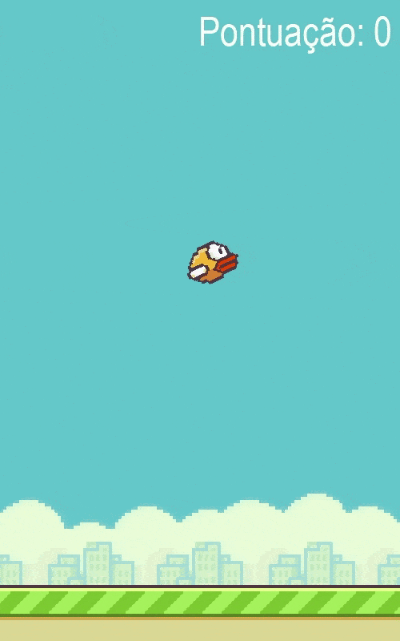

<h1 align="center">FlapPyBirdLearning</h1>
<h3 align="center">Rede neural aplicada ao jogo FlappyBird :baby_chick:</h3>

 

  	
  
	
  
  
  
  
   

 ---
 
&nbsp;

 
 <h3 align="center">Game</h3>

  

